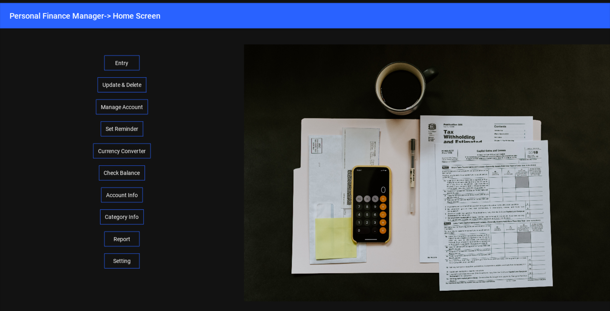
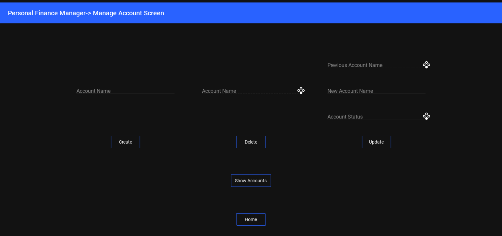
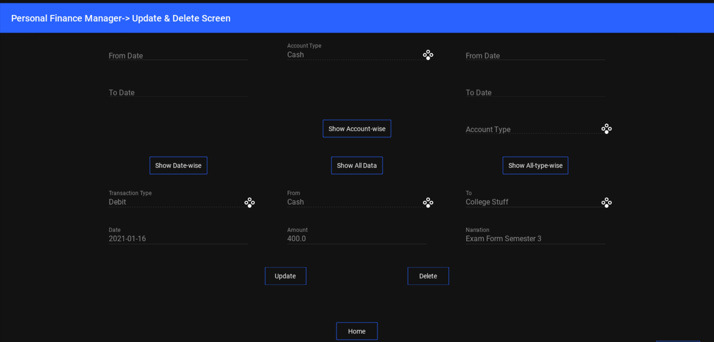
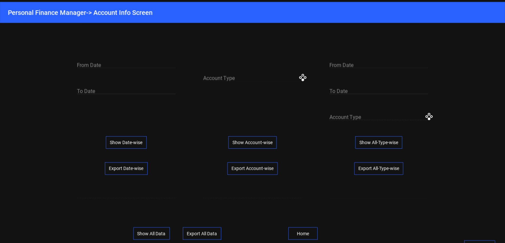
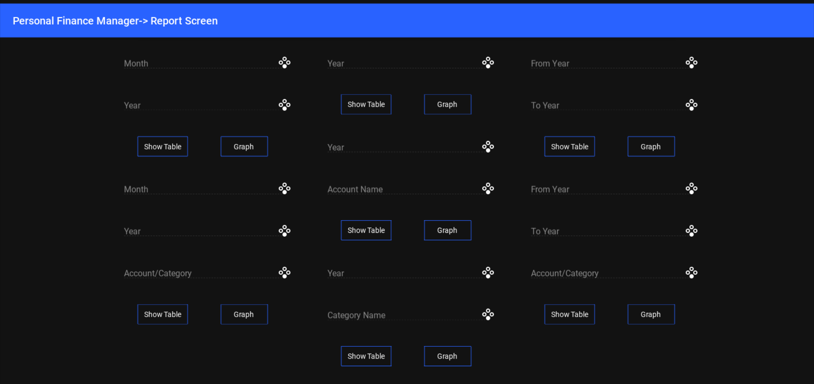
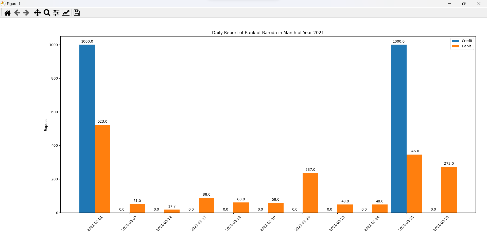
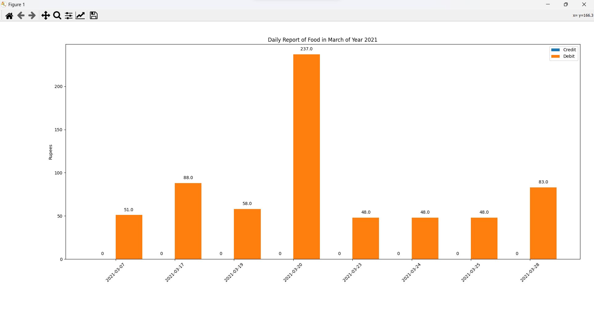

# PocketBuddy

## Description
This is a personal finance manager that allows users to track their income and expenses. Users can create an account, log in, and add transactions to their accounts. The app will display the user's current balance, as well as a chart of their income and expenses. Users can also edit and delete transactions. 

## Features
- Manage Multiple Accounts
- Record Income and Expenses
- View Account Balance
- View Income and Expense History
- View Income and Expense Charts
- View Data by any Constraints
- Reminders
- Currency Exchange Rates

## Tech Stack
- Python
- Kivy, KivyMD (UI)
- SQLite3 (Database)
- Matplotlib, Seaborn (Graphs)
- Pandas (Data Analysis)
- Yagmail, win10toast (Emails & Notifications)
- BS4, Requests (Web Scraping for Currency Exchange Rates)


## Installation
1. Clone the repository
2. Install the dependencies
``` 
pip install -r requirements.txt
```
3. Run the app
```
python app.py
```

## Screenshots

<p align="center">
    
</p>

<p align="center">
    
</p>

<p align="center">
    
</p>

<p align="center">
    
</p>

<p align="center">
    
</p>

<p align="center">
    
</p>

<p align="center">
    
</p>

